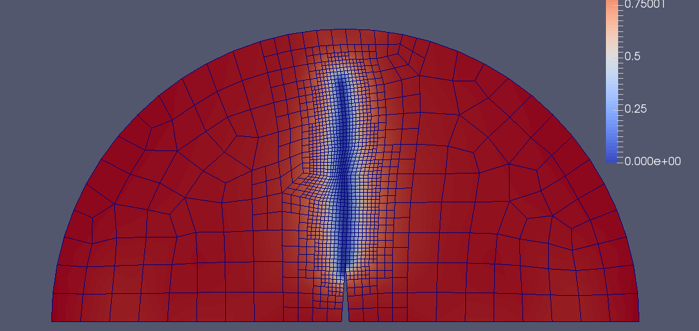

# Phase-field-solid

This is a C++ code written to model fracture propagation in a 2D solid body.

The code is based on a phase-field model with active primal-dual set algorithm
described in (though they might have done a better job describing the
intricacies of implementation):

T. Heister, M. F. Wheeler, T. Wick:
A primal-dual active set method and predictor-corrector mesh adaptivity for computing fracture propagation using a phase-field approach.
Comp. Meth. Appl. Mech. Engrg., Vol. 290 (2015), pp. 466-495
http://dx.doi.org/10.1016/j.cma.2015.03.009

Note: I am not the author of that paper!

## Features
- Works in parallel (MPI)
- Adaptive mesh refinement
- Input files
- Reads mesh in .msh format (exported from GMsh)
- Parallel output to .vtk

## Usage
Build deallii with mpi, Trilinos, and p4est from
- dealii http://www.dealii.org/download.html
- Trilinos https://trilinos.org/
- p4est http://www.p4est.org/

Also, you need to have Boost library built or installed
(libboost-all-dev on Ubuntu)

### Building Trilinos for dealii
The following installs dealii into /home/user_name/share/trilinos
~~~~
cmake \
-DTrilinos_ENABLE_Amesos=ON \
-DTrilinos_ENABLE_Epetra=ON \
-DTrilinos_ENABLE_Ifpack=ON \
-DTrilinos_ENABLE_AztecOO=ON \
-DTrilinos_ENABLE_Sacado=ON \
-DTrilinos_ENABLE_Teuchos=ON \
-DTrilinos_ENABLE_MueLu=ON \
-DTrilinos_ENABLE_ML=ON \
-DTrilinos_VERBOSE_CONFIGURE=OFF \
-DTPL_ENABLE_MPI=ON \
-DBUILD_SHARED_LIBS=ON \
-DCMAKE_VERBOSE_MAKEFILE=OFF \
-DCMAKE_BUILD_TYPE=RELEASE \
-DCMAKE_INSTALL_PREFIX:PATH=$HOME/share/trilinos \
..

make
make install
~~~~

### Building dealii
This process is pretty straightforward and is described at http://www.dealii.org/8.4.1/readme.html.

I ran the following cmake command (for system-wide installations)
~~~~
cmake -DCMAKE_INSTALL_PREFIX=/usr/local \
      -DDEAL_II_WITH_MPI=ON \
      -DDEAL_II_WITH_TRILINOS=ON \
      -DTRILINOS_DIR=/path/to/trilinos \
      -DP4EST_DIR=/path/to/p4est \
      ..
~~~~

### Building p4est
That was super easy so I didn't even save instructions for it. Sorry about that.

### Running
The following runs the three-point-bending case:
~~~~
cmake .
make
mpirun -np 1 ./pds three-point-bending.prm
~~~~

## Notes
Author: Igor Shovkun
